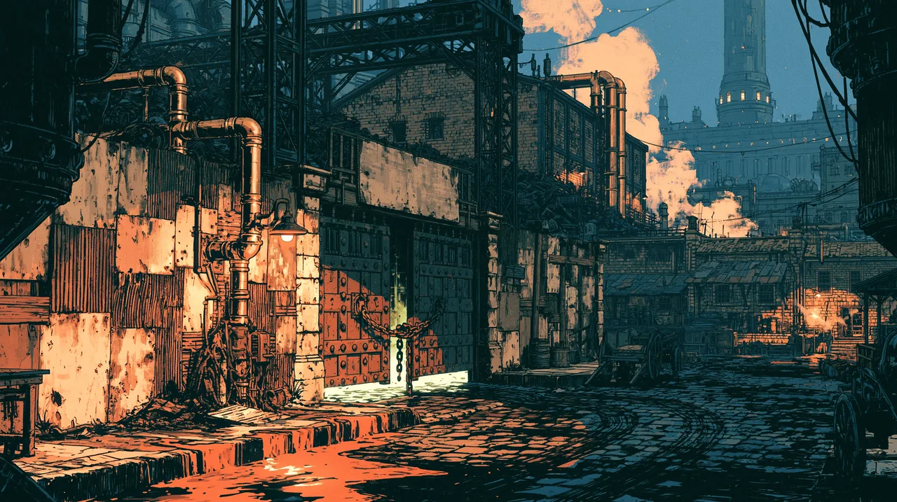

# Claringbold's Yard

A breakers' and construct-maintenance yard on the edge of [[The Core|the Core]],
technically still in [[The Stacks]] - one of many places in the city where dead
essence machinery is brought to be stripped, repaired, or broken for parts. Its
speciality is [[Constructs]], and chiefly Bullyboys: hauling frames come in worn
out or damaged and go out working again, and the ones past saving are taken apart
for their cores.

Because it handles cores, the yard operates under a
[[The Corewright's Association]] licence, renewed for a fee.

It is run by [[Shrapnel]], with a crew of five or six young lads.
[[Billiam Buckman|Billiam]] has worked here since [[Theodore Blackwood]] found him
the job.

## The yard itself

A makeshift wall about six feet high, just taller than a man, with the office at
the back - a repurposed warehouse where Shrapnel does the paperwork he would
rather not be doing. Between the gate and that office the ground is given over to
scrap heaps and work areas, enough of them that getting to the office is a matter
of picking your way through a small maze, though the door is visible from the
gate.

It is a walk of half an hour or more from Billiam's home in the Stacks, and the
night shift is all but empty - most of the work happens by day.

The gate is kept on a latch, and the patchwork wall has gantries and cranes along
it that can be climbed to see who is at the gate. The takings go in a secure
drawer at the back of the office, and Shrapnel takes the money away somewhere
every night rather than keep it on the premises.

## The guild men

The guild people Billiam has seen leaning on the yard are collectors from
**[[The Corewright's Association]]**, come for their dues. That is a semi-normal
occurrence, although what Billiam saw was a bit different from normal.

## The yard's constructs

Two Bullyboys work the yard, both named by Billiam after his favourite foods:
[[Shepherd]] and [[Steam Bun]].

## The raid

On the morning of Wexdae, Tide 03, 756, the gate was unlatched and the yard silent
on a working day. **No other workers were seen all day.** The office and its back
room had been searched and smashed, drawers pulled out, and the secure drawer
broken open and empty. There was no blood. Shepherd has lost a leg and still
walks; Steam Bun was hit with something heavy and cannot get up. Neither Billiam
nor Aeska could repair them.

Felix spoke with Shepherd, which said the attackers were *"big, green coat,
blonde man, very fast,"* and that Shrapnel was taken.

The yard is the **last legible entry in Theo's ledger**, with **x30** beside it.
