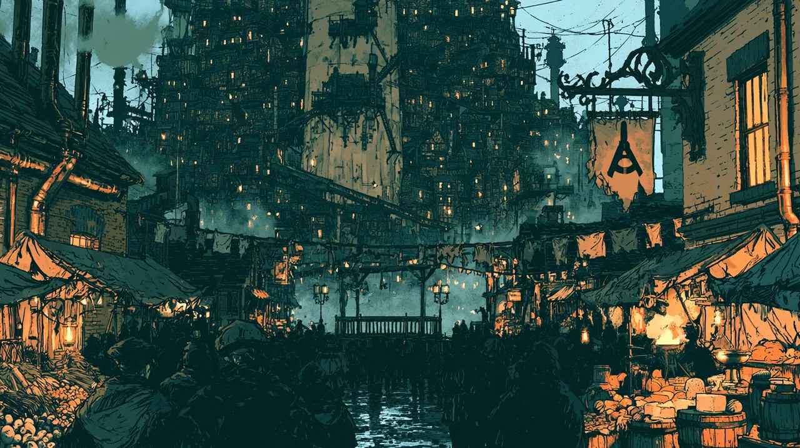

# Oblong Square

A public square on the **south edge of the Stacks, where it meets [[The Core|the Core]]**. Home to the tavern **The Plumb and Bob**, a fixture of the lower districts.

The square is overlooked by **four guild spires** with clean sightlines onto its
stage end, and by some **twenty windows** with line of sight to its centre.
[[Theodore Blackwood]] was shot dead on that stage at Harvest Fest, Terr 00 756.

