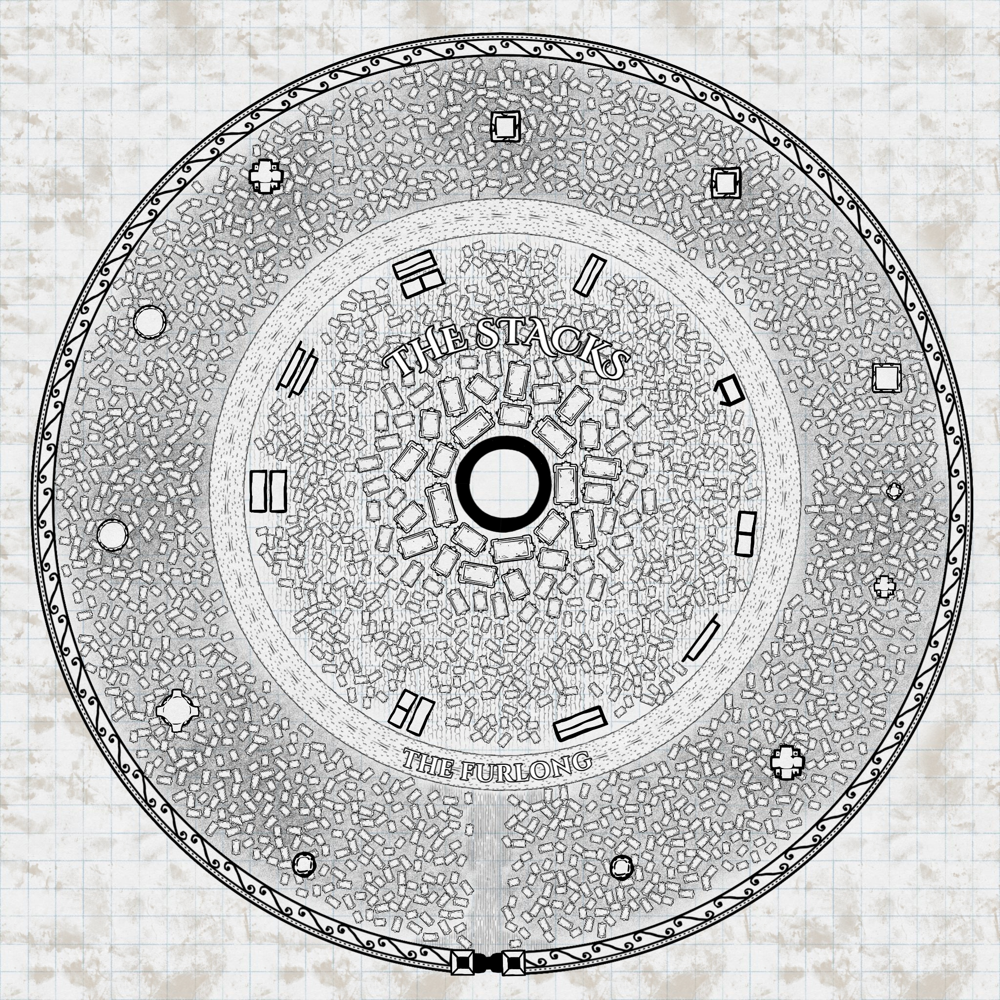

# Parvo

Parvo, a city of spires, surrounds the chimney of a power plant powered by a huge
essence engine. The poorer districts have built up over time with their buildings
backing onto the chimney, its warmth a free comfort through ever-colder nights.
Richer residents build towers further from the chimney, the outer ring of the
city being the most sought-after — as far as possible from the humidity and
pollution of the centre.

The city is roughly circular, a consequence of its once-planned construction. It
features a number of districts, named over time as the population swelled with
refugees fleeing the outside.

## History

Parvo was originally the base site of a huge essence engine and surrounding
mechanisms, designed to create and supply heat to the many settlements built up
around the cooler highlands where it sits. This heat was pumped out not only to
warm homes but to power mining and other industrial processes further up the
mountainside.

The large curtain wall surrounding the complex was originally designed to seal
any wayward essence eruptions from the outside world. After [[The Theocide]] and
the rain of blood, however, those walls instead guarded the interior against the
brunt of corrupted creatures, while its elevated position protected it from
runoff. The engineers within were quick to patch roofs and add shelter over the
industrial buildings, creating a contained space where very little corruption
could seep in through rainfall.

Parvo became a safe haven, and the surrounding settlements quickly flooded in —
the engineering guilds that had worked in the facility unwilling, or simply
unable, to turn them away. It is one of [[The Seven Cities]].

## Districts

- [[The Bellows]] — the undercity of pipework and tunnels
- [[The Stacks]] — homes built up the warm central chimney
- [[The Furlong]] — the great ring road and the Circular tram
- [[The Spires]] — the towers of the rich and powerful

## Governance

Parvo is governed by [[The City Council]], drawn from the leaders of its most
powerful guilds.
