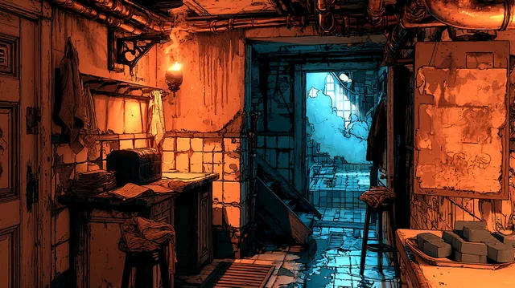

# Salador's Slip

A bathhouse in [[The Stacks]], close to [[The Brassline]] depot, run by
[[Madame Rooke]]. A three-storey Stacks house built against a chimney.

The **ground floor** is a large bath built into the floor. The chimney's warm
concrete heats the house, but not enough to heat bathwater, so the house has dug
down and exposed the essence pipework that runs hot under the street, and uses it
to heat the bath. **Not technically legal**, and nobody much cares, because the
house provides the service.

The **floor above** is a corridor of rooms - private rooms for the workers, and
rooms for customers - with a stair at the end of it up to the **top floor**, where
Madame Rooke lives and works behind a heavier, more ornate door.

It opens around **two or three in the afternoon** and runs until **one or two in
the morning**. Guests are expected to have come in during the evening; it is not
somewhere to walk up to at any hour and take a room. The house considers itself a
cut above most places in the Stacks, and says so.

[[Lark]] has been coming here for a long time, almost every day, and knows the
people who work here.

## The house

- [[Madame Rooke]] - the proprietor.
- [[Delia]] - the senior of the workers, something like an older sister to the rest.
- [[Nell]] - Lark's age, and her friend.
- [[Emory]] - the doorman, who is stronger than he looks.

## The night Lark turned up

Lark arrived at about half past midnight on Tide 03, 756, still bloody from
[[The Bellows]]. Emory turned her away and caught her when she tried to dash past
him. Delia let her in on the understanding that she would answer to Madame Rooke
in the morning, and Lark cleaned the whole house through the small hours, slept in
Nell's room, and went up to see Madame Rooke at seven.
