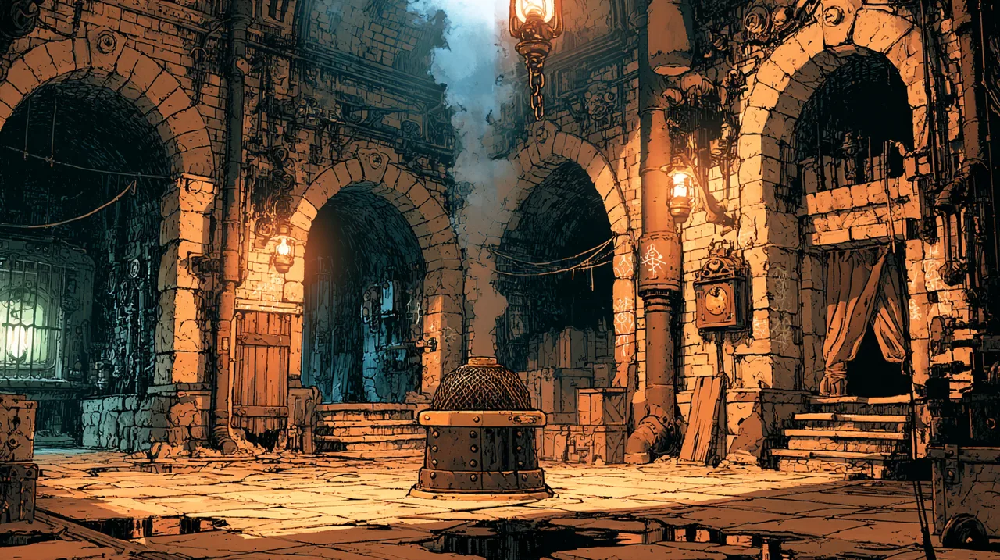

# Subterminal 8T

A junction chamber deep in [[The Bellows]], out past the residential tunnels near
the chimney.

A **terminal** is a circular room where a number of tunnels meet, usually more
than four. A **subterminal** is a smaller one of the same kind, further down a
particular tunnel. 8T sits off terminal eight.

The room is circular, with **eight tunnels running off it** and a **single steam
outlet in the centre** venting straight up through grates at street level. The
air in it is thick with steam and curling smoke, and you cannot see clearly
across it. There is a **raised barricade above the eastern side**, ten feet or so
up, that a person can lean out over.

Getting there means passing through the residential stretch of the Bellows first,
where people live behind doors set into the tunnel walls. [[The Below Boys]] work
those stretches less often - robbing somebody outside their own front door makes
enemies - so what danger there is begins further out, where nobody lives.

**[[Harriet Spurnhold]] was shot here**, at midnight on Tide 02, 756, handing
[[Theodore Blackwood]]'s ledger to [[Felix Klaudius]].

