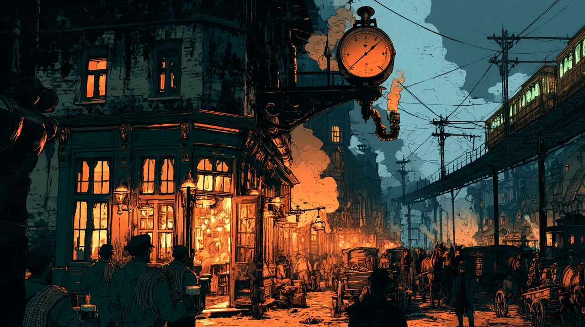
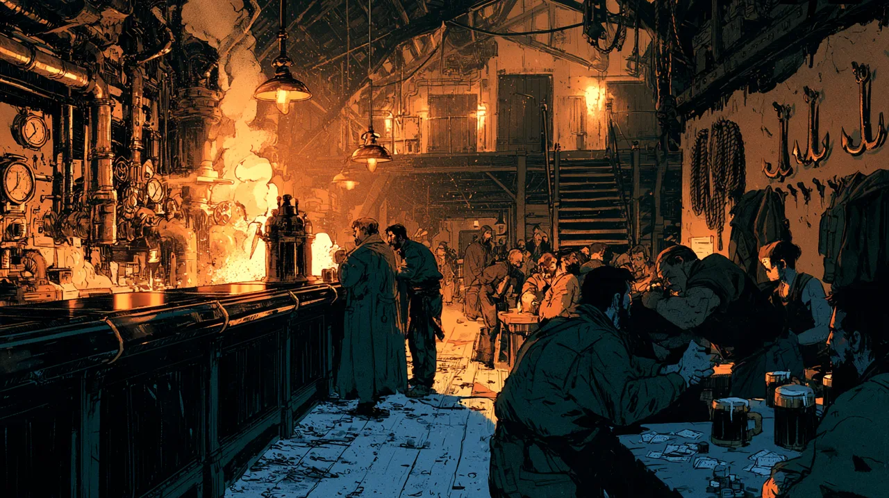

# The Head of Steam

A big, busy public house on the inner edge of [[The Furlong]], in
[[The Core|the Core]], just across the ring road from the
[[The Porter's Guild|Porters']] spire. It is a Porters' haunt: crews come off their
routes and drink here, and most nights it is loud with them. The street outside is
one of the busiest in the city - a great steam-powered workman's clock dominates
it, and [[The Circular]] runs past - and the house has several doors, so there is no
watching who comes and goes.

It is a drinking house and nothing else. The **ground floor** is one large, crowded
bar with long shared tables. The walls are hung with Porter's Guild paraphernalia,
ropes and hooks, the way a regimental bar is hung with colours, and a great many of
the drinkers wear the guild's dark green coats. Behind the bar a steam-powered
contraption works the pumps, and scratchers run messages between the kitchen, the
bar and the rooms. Dice are everywhere: the game is [[Games|Runs]].

**Upstairs**, off a balcony corridor, are **five private rooms**, taken by the
evening for drinking and cards, with servers carrying trays up to them all night.
Four have ordinary doors. The fifth, at the end, has an **ornate frosted-glass
panel** and is plainly the room for whoever matters most.

It is run by [[The Baron]], an ex-porter, and the Guild has no claim on it. It is a
Porters' pub because of who runs it and who drinks there.

Roughly a third of the people drinking here, by Calder's reading, work outside the
law, and plenty of those wear guild green.

## Episode 5

The party came in on Lumesdae night, in ones and twos. Calder played Runs at a table
of gamblers and came away with the name Evan; Lark and Felix worked the crowd;
Billiam climbed the alley wall to look in at the upstairs windows; and Aeska, in
disguise, talked the Baron into sending him up to play for the room behind the
frosted glass, where [[Evan Langford]] was playing cards with the two agents who
have been hunting them.

