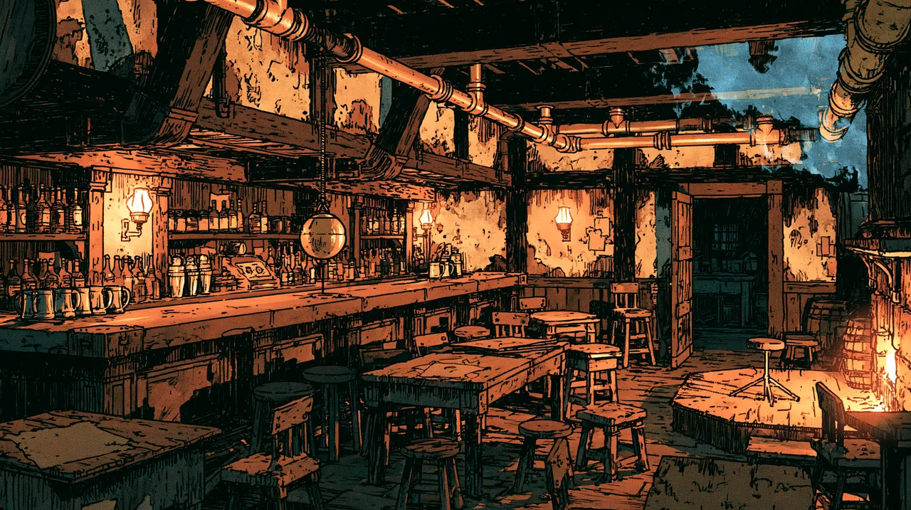

# The Plumb and Bob

A tavern on [[Oblong Square]], at the south edge of [[The Stacks]] where it meets [[The Core|the Core]] - a fixture of the lower districts. It is plain, cheap and dependable: a low-ceilinged common room, a well-worn bar, and a **back room** that can be borrowed for meetings, lectures, and the like. It takes live musicians.

The name comes from the builder's **plumb-bob** - a weight on a line, for finding true vertical - that still hangs behind the bar, left by the founder, a pipeman and builder for whom the tool was his trade. **"True and level"** is the house's unofficial motto.

The proprietor is **Harl Mott**, a heavyset, slow-moving man who keeps the place exactly as it has always been.

