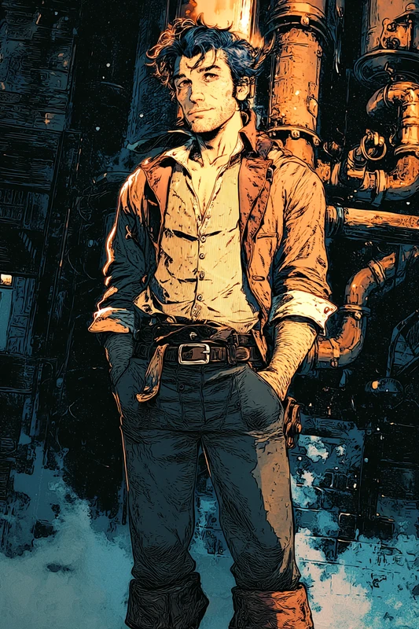

# Theodore Blackwood

Theodore - known as Theo to his friends - is a prominent guild spokesperson and
upcoming politician in [[Parvo]]. Rumoured to be the first [[Aela]] ever born
(though this is hard to verify), he is charismatic, friendly, and open, often
seen as a pleasant contrast to the other stuffier, ornery guild representatives.

Theo is considered a "man of the people," having started his career in
[[The Bellows]] as a pipe-maintenance worker before working his way up the ranks
of [[The Guild of Engineers]] to his current position as Chief Essence Transfer
Supervisor. While he considers himself a decent engineer, he is by no means
gifted in the technical arts - instead he has benefited from his people skills
and helpful manner to get ahead.

Despite his rise in social status, Theo has kept his home in [[The Stacks]],
preferring to remain within the community where he grew up. He was a speed
climbing champion in his youth and still visits the climbing gyms, and is a keen
astronomer and stargazer.

From the offices of the Guild of Engineers' spire (see [[The Spires]]), Theo has
spent the last few years campaigning for a fairer system - championing the idea
that voting should establish a truly democratic government in Parvo, rather than
power lying in the hands of the biggest guilds. While still a small movement, his
standing in the labouring communities and his general charisma have built a
following for his ideas among the Stacks and the less politically mobile
communities of the city.

## His death

**Theo was killed at Harvest Fest, Terr 00 756.** Speaking from a stage in
[[Oblong Square]], he allowed that the guilds had done great things when the fate
of humanity rested on them, but that this was over thirty years ago, and put
forward a new idea: a vote, for the leadership and the future of [[Parvo]], in
which every Parvosian gets a say.

He was shot through the chest mid-sentence and fell from the back of the stage.
The wound was far beyond a pistol or an essence crossbow and no healing would
take; Felix and Lark both reached him and he was already dead. From the way he
fell, the shot came from the direction of [[The Core|the Core]], away from
[[The Stacks]]. Lark counted four guild spires with clean sightlines onto the
stage.

## Relationships

- **Member of** [[The Guild of Engineers]] - Chief Essence Transfer Supervisor
- **Opposes** the guild rule of [[The City Council]] - campaigns for democracy
- **Risen from** [[The Bellows]]; **lives in** [[The Stacks]]
- Rumoured to be the first [[Aela]]

> *The party are each connected to Theo in some way.*

## After his death

His office at [[The Guild of Engineers]] was searched by guild clerks and
guardsmen within a day of the killing, on the stated grounds of protecting guild
secrets. **It held nothing of interest** - everything in it was ordinary and
above board.

**His house was ransacked the night he died**, by at least two people, before
anyone else reached it. Files and papers are gone; the gaps where they were are
visible. A neighbour heard them and thought he had come home with friends.

**His body was never delivered to [[The Institute of Physikers]]**, where the
night staff waited for it. Nobody knows where he is.

There has been **no funeral and no word of one**. He appears to have had no
family, and nobody knows who would arrange it.

## The meetings

He held **weekly meetings in the back room of [[The Plumb and Bob]]**, every
Ersdae eve, paid for and discreet. [[Harl Mott]] was paid not to listen, and did
not.

They were political discussion rather than organising - what if we could vote,
what if we could decide things for ourselves - and by the account of those who
attended they were never violent and never radical.

**A couple of weeks before he was killed, two strangers came into that tavern and
argued with him there.** See [[Barry Killerman]].
