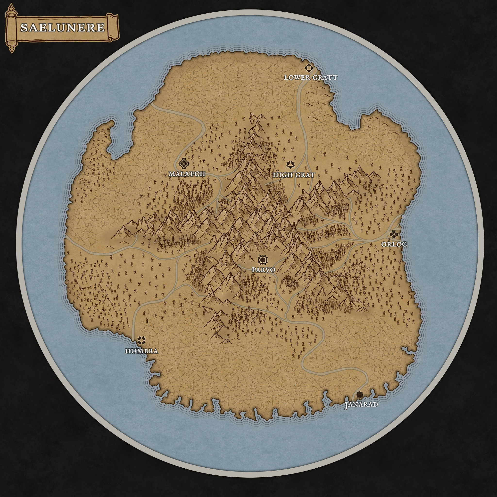

# The Seven Cities

The majority of the landmass of Saelunere is corrupted by the spilt blood of
[[Aelia]]. A dark and black mucus spreads throughout the ground, killing or
severely wilting plants, poisoning water, and killing most wildlife. Animals and
humans unlucky enough to survive — through slow exposure or happenstance — have
mutated into corrupted, zombie-like beasts.

Seven cities survived the fall:

- [[Parvo]]
- [[Malatch]]
- [[Orloc]]
- [[Humbra]]
- [[Janarad]]
- [[High Grat]]
- [[Lower Gratt]]

## Where they sit (the map)

- **Parvo** - the **hub**, at the southern foot of the central massif. Compasses point at it.
- **High Grat** - upland, a short way edgeward of Parvo toward the northern rim.
- **Lower Gratt** - further edgeward along that same road, near the northern coast (High = upland, Lower = downhill).
- **Malatch** - edgeward on the counterwise flank (inland-ish, upper-left of the disc).
- **Orloc** - on the eastern coast, edgeward and turnwise of the Gratts.
- **Janarad** - on the southern coast, further turnwise - a genuine **port** city.
- **Humbra** - on the southwestern coast, edgeward on the counterwise flank.

Going **turnwise** (clockwise) around the rim: Lower Gratt -> Orloc -> Janarad -> Humbra -> Malatch, and round again.
