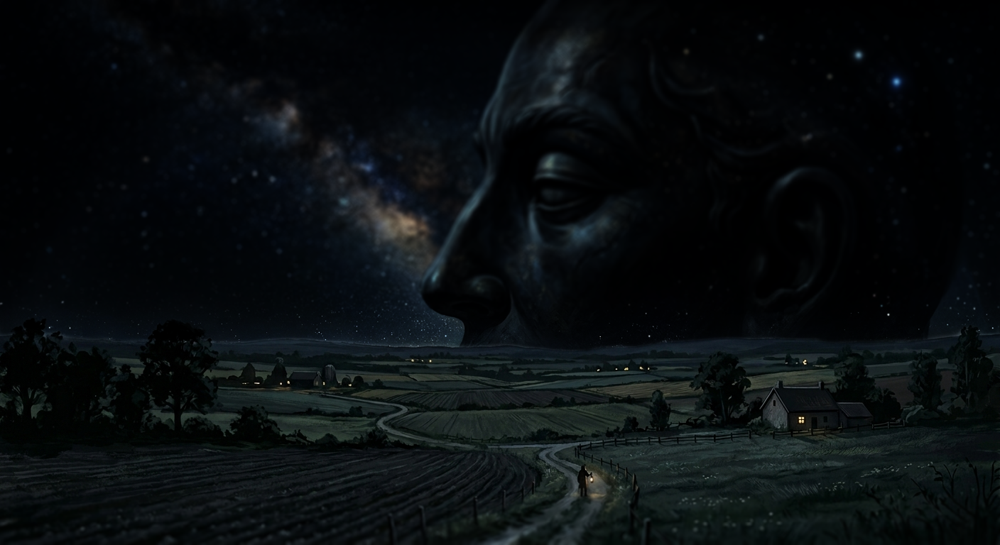

# The Theocide

Twenty-eight years ago, [[Aelia]] died.

Every person watched as the warrior of light was cut down, a black gash opening
her from shoulder to hip. It took many months — a slow and agonizing death
witnessed by those below. At first they hoped it was just a flesh wound, until
the cut became a ravine, dark ichor pouring out for weeks until it covered the
sky in days of eclipse.

A few weeks later, the other gods discovered their fallen sister, and the cry
they made broke everyone who heard it: a deep and mournful Godswail plucked from
titanic throats that lasted many days and turned some to madness from empathy
alone.

After that, nothing was the same. Light no longer had its same radiant quality,
shadows dwelt uncomfortably, plants withered, and the land greyed. All the while
Aelia's corpse lay floating out in the void, slowly getting smaller and smaller
as she drifted away.

## The Rain of Blood

Within a year, the liquid that was once her lifeblood collided with the outside
of Saelunere. The dark black splatter hit the outside of the orb and began to
leak inside. Rain turned pure black, acrid and withering. Whole cities died
overnight, the air heavy with choking black dust, their corpses riddled with grey
veins and mutations.

People survived, as they always do — some through protective magics, others
through great feats of engineering, others still purely on luck and
determination. Over time, the survivors gathered to the safest places and built
on what was left. Seven of those refuges endured: [[The Seven Cities]].

## The Aela and the Darkin

The first child born after the cry of the gods was an Aasimar. From that point
onwards, all children born were either Aasimar or Tieflings, seemingly at
random — known as [[Aela]] or [[Darkin]].
